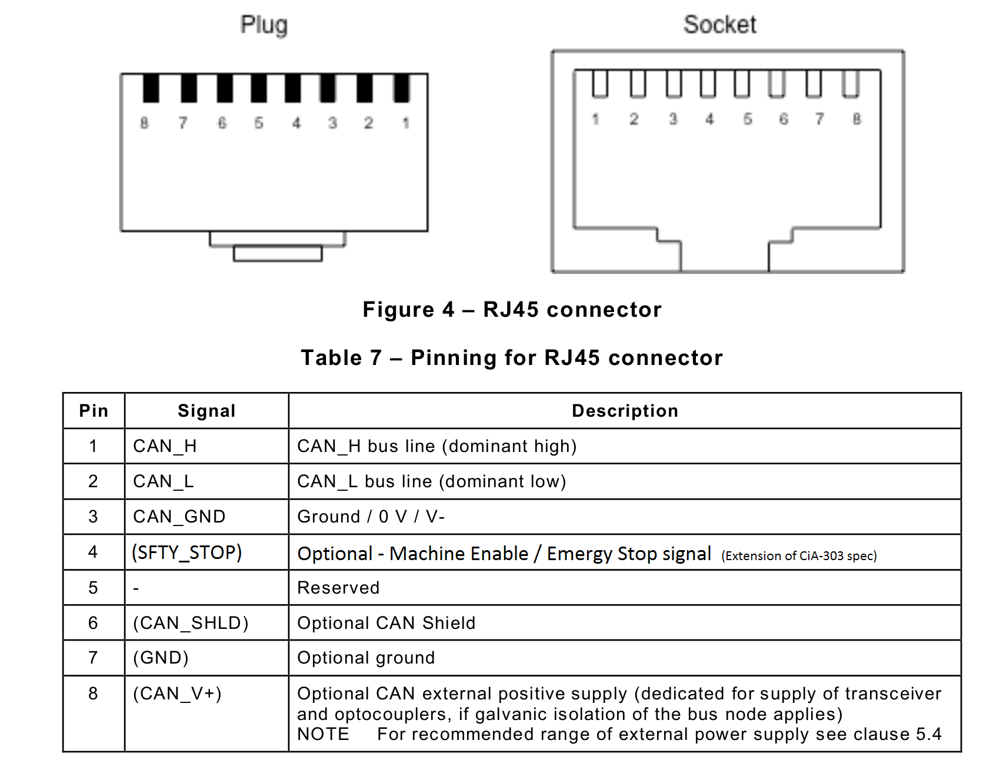

# OSEnergy Design Guide
##
The OSEnergy architecture is designed to allow for distributed cooperation of DC charging sources meeting the needs of storage batteries and concurrent house loads.
 
This Design Guide covers the Architectural Philosophy of OSEnergy, leveraged standards, as well as details of the implementation of those standards.  Refer also to the `OSEnergy Programming Guide` for additional specifics around the API and required / optional capabilities of devices.

   
## Architectural Philosophy

The core philosophy of OSEnergy is based on a distributed architecture combined with communications between devices, as opposed to a complex centurial device.  Benefits of the distributed approach include: simplification of each device - it can focus on its task and responsibilities.  Easy expansion / installation, new capability is added and adopted simple into the system as opposed to the need to create (and revise) a detailed configuration profile in a central device. And the elimination of a single point of failure associated with a central device.  By using the distributed approach, device complexity is lessened, installation and subsequent modifications are simplified, and reliability is increased.

At present, OSEnergy recognizes three broad categories of devices:
- Charging Devices (Solar, Alternators, Generators, Shore power, etc)
- Battery Masters (BMS, Battery Monitors)
- Displays and Bridges

Each of these device types play a specific role in the deployment of a well designed system, and each has specific responsibilities to the system. 
  

#### Charging Devices (ChrgDev)
Charging devices supply power to the system.  The power is most commonly used to replenish a battery, and/or to support house loads - lights, pumps, radios, etc.  Charging devices are responsible for delivering power as needed by the system.  A core concept of OSEnergy is Prioritization.  By assigning a priority to each charging device, power may be supplied by the most efficient source.  Example, Solar panels will work to their maximum capability, while the alternator regulator will back off conserving fuel.  At the same time like priority charge devices will self balance, such as  alternators attached to twin engine installations in a marine environment.

  
#### Battery Masters (BatMan)
Battery Masters monitors a battery to determine its needs and status, and then communicates that information to other devices in the system.  A Battery Master may only monitor or may also actively manage the battery, ala a full BMS performing cell balancing on a LiFeP04 battery bank. The Battery Master serves a critical role, akin to that of a conductor of a symphony orchestra.  Just as a conductor guides an orchestra to assure all members are playing the same tune, as well as monitoring and making needed corrections to assure a positive result, a Battery Master makes decisions as to the needs of the battery. Charging devices then adjust their output to meet those needs.  No more will different charging devices independently attempt to decide the needs of the battery, often fighting each other as they individually play 'King of the Mountain'.

Battery Masters play a critical role in deciding how batteries should be managed.  More advanced concepts include operation modes - where the battery needs may differ when the system is actively being used vs. when it is in longer term storage over the winter.  The OSEnergy specification allows Battery Masters to direct charging devices to dynamically meet changing  goals.

Battery Masters should have the following minimum hardware battery measurement and reporting capabilities:

| Measurement  | Resolution  | Accuracy  |
|:-:	|:-:	|:-:	|
| Voltage | 5mV  |   0.5% |
| Current  |  50mA |  1%  |
|  Temperature |  1C |   5% |

Refer to the `OSEnergy programming Guide`  for additional communications requirements of a Battery Master.

  
#### Displays and Bridges
Providing the ability to configure and/or monitor how the DC system is performing.  These types of devices may be passive (monitoring / translation only), or active (providing configuration or real time goal adjustments).  Examples include generator control panels, bridges to other protocols such as Signal-K or NMEA2000, battery SOC displays.  All such capability falls under the Display and Bridges device types.

  
#### Distributed Architecture
OSEnergy is a distributed architecture.  Each device has its responsibilities and capabilities.  When a device joins the system it will announce its presence as well as its capabilities - and existing deices will adjust as appropriate.  As an example, if a new Battery Master joins the system and has a higher priority than the existing one, Charging Devices will start following its lead.   In a like way, if the current Battery Master fails in some way, a lower priority device will then be free to 'step up to the plate' and assume the overall conductor role.   The Distributed approach allows for simple addition of devices without the needs for onerous and error prone reconfiguration of each node, as well as automatic fail over in the case of problems.

It should also be noted that devices may at times serve more than one role.  A system consisting of a single solar MPPT controller and an alternator, the solar controller (if it has sufficient instrumentation capabilities) may act as both a Charge Source and the Battery Master - thereby coordinating with the alternator so that both work cooperatively as opposed to fighting each other.

    
#### Device Priority
A core principal in OSEnergy is the concept of Device Priority.  Device Priority allows for the negotiation of the systems Battery Master, where the highest priority Battery Master will be recognized as the overall system `conductor’.  Priority also allows for optimization of charging sources to assure the most cost effective source of energy is used.  Let Solar do the final stage of battery charging as opposed to the engine alternator.

    
#### Battery ID
A system may consist of one or more DC batteries.  In a simple off-grid application there may be only one (the house battery), while in a marine application there may be several (house, starter, bow-thruster).  OSEnergy allows for many batteries on a system through the concept of Battery ID.  By configuring a device with its associated battery ID, devices will seamless integrate into the overall system without the need for physically isolating the CAT-5 CAN bus dedicated to each battery.

 

      
# Leveraged standards
OSEnergy utilizes several existing standards for both Hardware as well as Software.  These include:
- ISO 11898 (Control Area Network Physical/Data Link layer)
- CiA-303  (RJ-45 hardware connector specification)
- J1939 (Control Area Network Host layer)
- RV-C (Control Area Network Communication protocol)

Each of these standards are incorporated into the OSEnergy specification, with some modifications and specific additions as noted here and in the `OSEnergy Programming Guide`

   
### CAN hardware specification (ISO 11898 & CiA-303)
OSEnergy is built around  a Control Area Network (CAN) to provide for reliable communications between devices.  Utilized widely in transportation, industrial, agricultural segments, and more, the Control Area Network is a well established communications capability in very harsh environments.  OSEnergy leverages the basic CAN specifications as defined in ISO 11898-1 and ISO 11898-2, as well as the CiA-303 standard for physical cabling.

OSEnergy suggests for the use of RJ-45 connectors used in conjunction with CAT-5 cabling to provide for simple and cost effective cabling between nodes.  Termination of 120 ohms should be optionally provided for on devices and/or through the use of external terminators.  Other physical wiring standards are also allowed (ala, the DeviceNet standard, as used by NMEA2000 networks).

The RJ-45 connector follows the CiA-303 specification with some augmentations:

 

OSEnergy specification makes the following modifications to CiA-303:
- Pin 8 (CAN_V+) -->  Wider voltage range: 10v - 35v.
- Pin 4 (reserved) --> is used for a master GENERATOR ENABLE/STOP signal
- Pin 3 (CAN_GND) and pin 7 (GND) should be tied together.

CAN_V+ (pin 8) may be used in conjunction with GND and CAN_GND to power small devices attached to the OSEnergy network. Power draw should be limited to 175mA per device with the limit for all  self-powered devices not to exceed 350mA.  Care must be taken to not over burden the entire system with too many parasitic powered devices.  Sourcing for CAN_V+ may be supplied by a device or through a dedicated power injector.  There may be more than one power source, and blocking diodes on both CAN_V+ as well as GND/CAN_GND (or equivalent) should be used in any device or power injector to prevent any current loops in the CAT-5 cabling. 
  
 
 OSEnergy designates Pin 4 as a SFTY_STOP signal to enable as well as provide for emergency stopping of mechanical devices connected to the OSEnergy bus.  The prime example is the engine of a generator:
 
- SFTY_STOP (pin 4)  ENABLE:    At GND/CAN_GND potential
- SFTY_STOP (pin 4)  DISABLE:   Open

To ENABLED, connect SFTY_STOP to GND/CAN_GND.  Voltage level when enabled should be under 1V, and the device should be prepared to handle up to 100mA of current.  When SFTY_STOP is disabled, Voc (Voltage-open) may be as high as 40v.  A switch, FET or transistor are some example ways to accomplish this.  The Blocking diodes should be put into place to prevent potential for current-loops in the SFTY_STOP  & GND/CAN_GND wires.  Enable is a affirmative action, in that if no Enable signal presented to SFTY_STOP, devices will be disabled. All OSEnergy devices which present a human safety risk from mechanical motion (such as generator’s engines) must recognize SFTY_STOP.
 
  
    
### CAN J1939 specification
J1939 speciation is the foundation upon which OSEnergy is built on.  It is a commonly used standard with applications ranging from automotive, to marine, agriculture, and more.  The details of J1939 are often handled by the library selected, specifically topics such as address claiming and such.  Refer to the `OSEnergy Programming Guide` for details on which parts of J1939 must be supported.

 
    
### CAN RV-C specification
OSEnergy utilizes significant portions of the open source RV-C Communications specification, with some very specific deviations (refer to the `OSEnergy Programming Reference`  for details)   Created by RIVA, it is primarily targeted towards RVs, and as such as many messages not used in OSEnergy.  But it also has some key concepts important to allowing for a well coordinated  and integrated DC system.  Refer to the `OSEnergy Programming Guide` for a detailed list of CAN messages used in OSEnergy, as well as guidance on the application of those messages.

    
#### Conflicting Standards
In the event of conflicting standards, the `OSEnergy Design Guide` and the `OSEnergy Programming Reference` are the preferred reference.  Followed by RV-C and then all other specifications.

    
#### Co-existence with other CAN protocols
OSEnergy may co-existing with other CAN based protocols on the same physical bus, allowing for additional reporting and integration.  (ala, allowing an Alternator to report out NMEA2000 type messages to a display terminal, while also receiving engine details / RPM via standard J1939 packets).  However caution must be taken that other protocols not interfere with the OSEnergy messages, as well as vise-versa.  In the worst case a CAN-to-CAN bridge may be needed.

